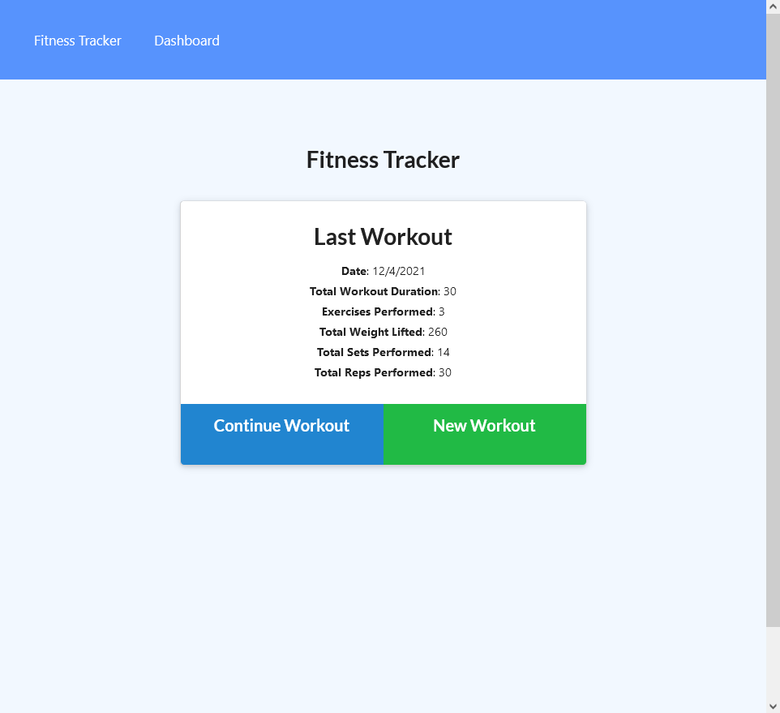
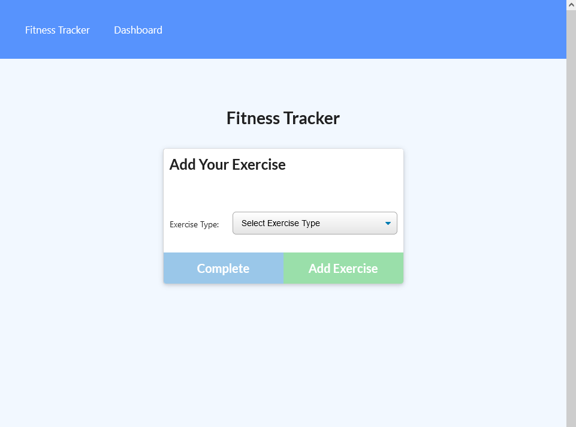
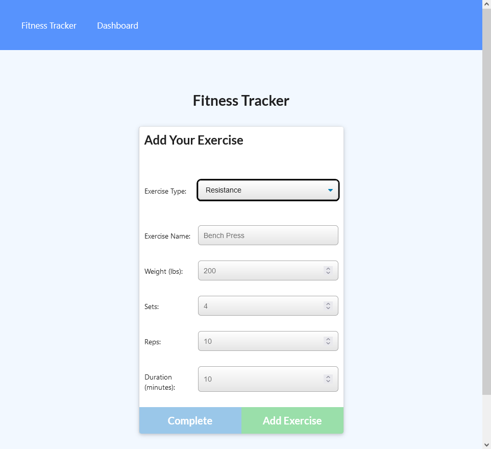
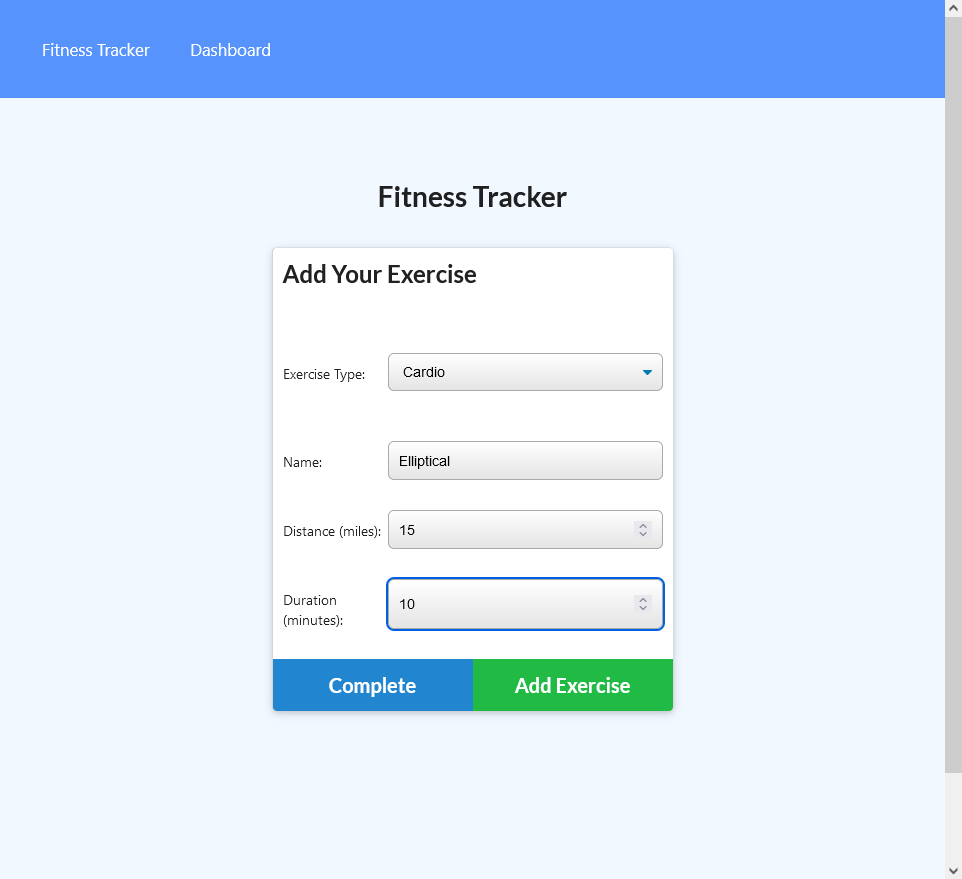
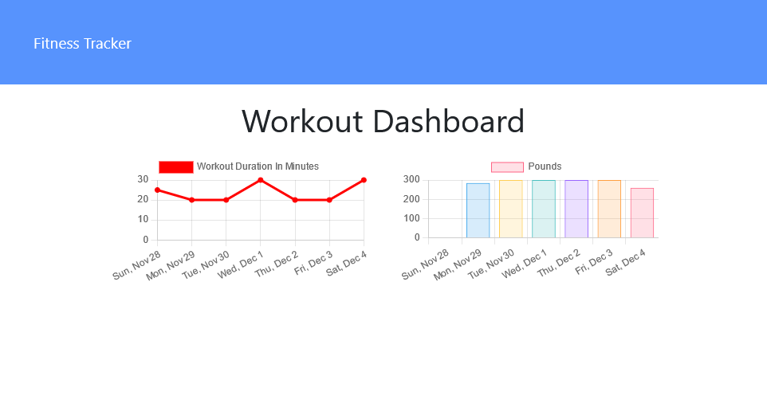

# Workout Tracker [](https://opensource.org/licenses/MIT)

## Description

A simple workout tracker built with MongoDB and Mongoose.js

## Contents

- [Installation](#installation)
- [Usage](#usage)
- [Tests](#tests)
- [Questions](#questions)
- [License](#license)

## Installation

First, clone the project and install all the dependencies as follows:

```
git clone https://github.com/baker-ling/workout_tracker.git
cd workout_tracker
npm install
```

This app relies on MongoDB, which you can run locally or remotely. To use a remote MongoDB, create a `.env` file inside the `workout_tracker` folder and add a line `MONGODB_URI=` followed by the URI for your database.


## Usage

To start the app, run the following command.

```
npm run start
```

Then, open the app in the browser. You will see the following welcome page, which shows a summary of the most recent workout.



From there, click the "Contine Workout" button to add more exercises to the last workout, or click the "New Workout" to go start a completely new workout and begin adding exercises to it. Both buttons take you to the following screen.



On the form to add exercises, select an exercise type (either cardio or resistance), and the app will show a form for that type of exercise.





Click either "Complete" or "Add Exercise" to add the exercise you entered. The "Complete" button will navigate you back to the welcome page whereas the "Add Exercise" button will stay on the same page to keep adding exercises.
 
The last feature is the Dashboard, reachable through the top nav bar. It shows stats from the seven most recent workouts.




## Tests

Seed data is provided for testing. Run `npm run seed` at the console to initialize the database with seed data so you can give the app a test run.

## Questions

If you have any questions, feel free to reach out via one of the following:

- Email: [brian.baker.bdb@gmail.com](mailto:brian.baker.bdb@gmail.com)
- Github: @baker-ling

## License

This application is distributed under the terms of [MIT License](./LICENSE).
